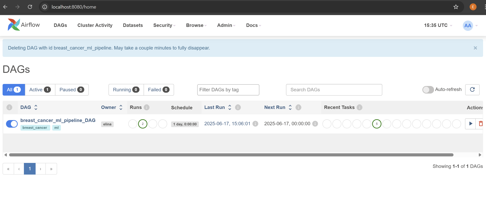
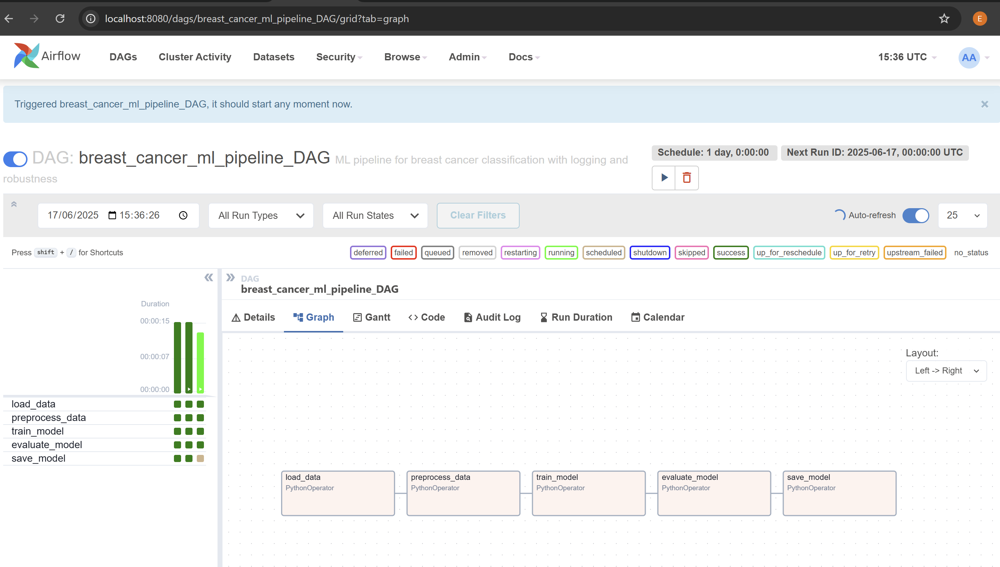
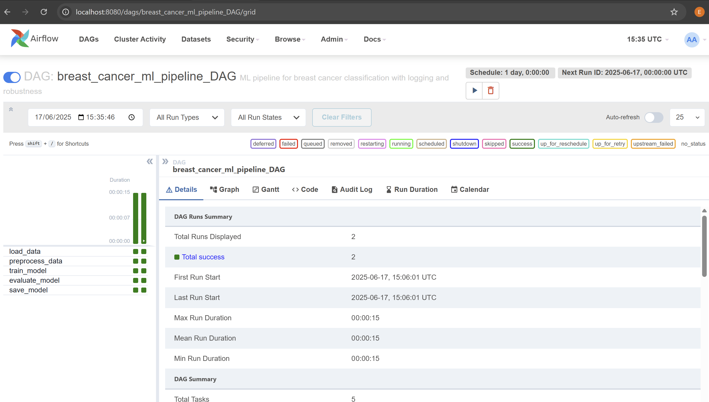

# Автоматизация и оркестрация ML-пайплайна с использованием Apache Airflow

## Содержание

- [Цель проекта](#цель-проекта)
- [Обоснование](#обоснование)
- [Архитектура проекта](#архитектура-проекта)
- [Описание пайплайна](#описание-пайплайна)
- [Инструкции по запуску](#инструкции-по-запуску)
- [Архитектурные решения](#архитектурные-решения)
- [Интеграция с хранилищем](#интеграция-с-хранилищем)
- [Обработка ошибок и устойчивость](#обработка-ошибок-и-устойчивость)
- [Идеи для развития проекта](#идеи-для-развития-проекта)
- [Скриншоты DAG-а](#скриншоты-dag-а)

---

## Цель проекта

Разработать оркестрацию ML-пайплайна с использованием **Apache Airflow**, включая подготовку данных, обучение модели и сохранение результатов. Используется встроенный датасет `breast cancer` из `scikit-learn`и модель — `LogisticRegression`.

---

## Обоснование

Airflow позволяет автоматизировать процесс подготовки данных, обучения модели и получения метрик, обеспечивая воспроизводимость и повторяемость экспериментов.

---

## Архитектура проекта

Проект состоит из следующих компонентов:

- Apache Airflow (оркестрация)
- PostgreSQL (мета-база для Airflow)
- Python-скрипты (реализация логики пайплайна)
- Локальное хранилище (`results/`) для данных, моделей и метрик

### Схема пайплайна:

<pre> <code>load_data.py</code> >> <code>preprocess_data.py</code> >> <code>train_model.py</code> >> <code>evaluate_model.py</code> >> <code>save_model.py</code> </pre>

## Описание пайплайна

| Этап               | Скрипт              | Выходной файл               |
|--------------------|---------------------|-----------------------------|
| Загрузка данных    | `load_data.py`      | `results/raw_data.xlsx`     |
| Препроцессинг      | `preprocess_data.py`| `results/preprocessed.pkl`  |
| Обучение модели    | `train_model.py`    | `results/model.pkl`         |
| Оценка качества    | `evaluate_model.py` | `results/metrics.json`     |
| Финализация модели | `save_model.py`     | —                           |


## Инструкции по запуску

1. Клонировать репозиторий:

```bash
git clone https://github.com/your_username/airflow-project.git
cd airflow-project
```
2. Построить и запустить контейнеры:

```bash
docker-compose up --build 
```
Первый запуск может занять несколько минут!

3. Открыть интерфейс Airflow:

- **URL:** [http://localhost:8080](http://localhost:8080)
- **Логин:** `admin`
- **Пароль:** `admin`

4. Активировать DAG:

- перейдите на вкладку DAGs
- найдите DAG с именем `breast_cancer_ml_pipeline-DAG`
- переключите его в положение ON
- нажмите кнопку Trigger DAG
---

## Архитектурные решения

- Docker позволяет воспроизводимо развёртывать проект на любой машине
- Использование PostgreSQL предпочтительнее SQLite для Airflow
- Разделение логики на скрипты упрощает тестирование и масштабирование
- Локальное хранилище снижает требования к ресурсам

---

## Интеграция с хранилищем

В папке `results/` сохраняются:

| Файл              | Назначение            |
|-------------------|------------------------|
| `raw_data.xlsx`    | Исходные данные        |
| `preprocessed.pkl` | Обработанные данные    |
| `model.pkl`        | Обученная модель       |
| `metrics.json`     | Метрики качества модели|


##  Потенциальные точки сбоя и реализованная устойчивость

### Загрузка данных (`load_data.py`)

- **Угроза:** Ошибка при загрузке встроенного датасета
- **Реализация:**
  - Обёртка `try-except`
  - Логирование ошибок с `exc_info`
  - Возможность локального перезапуска

### Препроцессинг (`preprocess_data.py`)

- **Угроза:** Пропущенные значения, пустой датафрейм, сбой в масштабировании
- **Реализация:**
  - Проверка структуры данных
  - Обработка ошибок с логированием
  - Возвращаются валидные train/test выборки

### Обучение модели (`train_model.py`)

- **Угроза:** Недостаток данных, модель не обучается
- **Реализация:**
  - Обёртка `try-except`
  - Проверка обучающей выборки перед использованием
  - Логирование успеха и ошибки

### Оценка модели (`evaluate_model.py`)

- **Угроза:** Деление на 0, несовпадение формата данных
- **Реализация:**
  - Расчёт метрик в `try-except`
  - Подробное логирование значений метрик
  - `classification_report` возвращается как словарь

### Сохранение артефактов (`save_to_local.py`)

- **Угроза:** Отсутствие файлов `model.pkl` или `metrics.json`, ошибка доступа к папке
- **Реализация:**
  - Проверка наличия входных файлов
  - Автосоздание выходной папки
  - Логирование путей сохранения

---

### Общие механизмы устойчивости

- Логирование (`logging`) на всех этапах с уровнями `INFO`, `ERROR`
- Обёртка `try-except` в каждом ключевом скрипте
- Повторные попытки (`retries=2`) при сбое задачи
- Задержка между попытками (`retry_delay=30 секунд`)
- Ограничение времени выполнения задач (`execution_timeout=5 минут`) — задача не зависнет навсегда
- Отключён `catchup` (`catchup=False`) — DAG не будет автоматически запускаться за пропущенные дни
- Изоляция шагов — каждый скрипт можно запускать независимо
- Проверки на существование файлов и корректность структуры данных

---

Таким образом, проект демонстрирует **устойчивость**, позволяя безопасно локализовать сбои и восстанавливать выполнение пайплайна по частям.

## Идеи для развития проекта

Проект можно улучшить и сделать более удобным и гибким. Вот несколько направлений:

- **Хранить данные и модели в облаке**  
  Это удобно, если проект будет запускаться на сервере или в команде.

- **Автоматизировать обновление проекта через GitHub Actions**  
  Например, чтобы при обновлении кода автоматически запускались тесты и DAG.

- **Добавить несколько моделей и сравнивать их**  
  Например, LogisticRegression, RandomForest и выбрать лучшую по качеству.

- **Сделать красивую визуализацию метрик**  
  Например, с помощью Streamlit или Dash — чтобы видеть точность и другие метрики.

- **Добавить тесты**  
  Чтобы проверять, что скрипты работают правильно и ничего не сломалось после изменений.

---
## Скриншоты DAG-а

### DAG в списке:


### Общий вид DAG-а:


### Успешный запуск:



